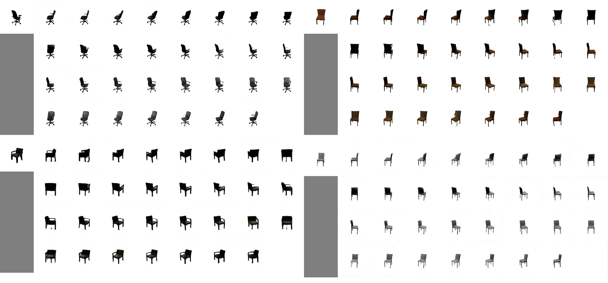

# deformable-view-synthesis (ECCV2020)
Tensorflow implementation of [**Novel View Synthesis on Unpaired Data by Conditional Deformable Variational Auto-Encoder**](https://arxiv.org/pdf/2007.10618).

**The network architecture**
<p align="center"> <br><center></center></p>

## Experiment Results
- chair
<p align="center"> <br><center></center></p>

- interpolation
<p align="center"> <br><center></center></p>

## Preparation

- **Prerequisites**
    - Tensorflow 
    - Python 2.x with matplotlib, numpy and scipy
- **Dataset**
    - [3D chair](https://www.di.ens.fr/willow/research/seeing3Dchairs/data/rendered_chairs.tar) 
    - [MultiPIE](http://www.cs.cmu.edu/afs/cs/project/PIE/MultiPie/Multi-Pie/Home.html)
	- Images should be placed in ./datasets/
- **Download model**
    - [Tool](http://download.tensorflow.org/models/vgg_16_2016_08_28.tar.gz)
        - model should be placed in ./models/
## Quick Start

Exemplar commands are listed here for a quick start.
### dataset
- prepare dataset

    ```console
    python dataset.py --path 'Path to Training Dataset'

### Training
- To train with size of 128 X 128

    ```console
    python cdvae.py --mode training --batch_size 32
    ```

### Testing
- Example of generating samples

    ```console
    python cdvae.py --mode generation --batch_size 1 --model_path 'Path to Training Model'
    ```

## Citation
If this work is useful for your research, please consider citing:

    @inproceedings{yin2020novel,
     title={Novel View Synthesis on Unpaired Data by Conditional Deformable Variational Auto-Encoder},
     author={Yin, Mingyu and Sun, Li and Li, Qingli},
     booktitle={European Conference on Computer Vision},
     pages={87--103},
     year={2020},
     organization={Springer}
     }
